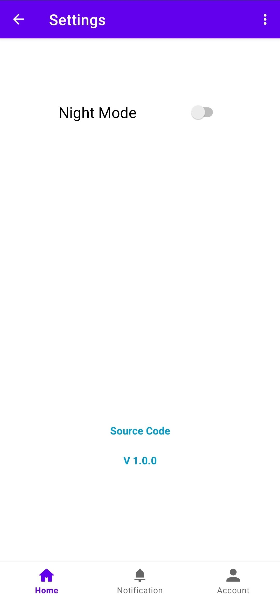

# PocketAi
It is a simple mobile application that offers basic AI tools to demonstrate Android programming principles and database,api integration


## Preview

<details>
  <summary>Show</summary>
  
*Demo Apk:* https://github.com/rekcah-pavi/PocketAi/releases/download/v1.0.0/app-release.apk

<table>
  <tr>
    <td></td>
    <td></td>
  </tr>
  <tr>
    <td></td>
    <td></td>
  </tr>
  <tr>
    <td></td>
    <td></td>
  </tr>
  <tr>
    <td></td>
    <td></td>
  </tr>
</table>


## Setup Instructions
### Prerequisites
- Android studio (2024)
- Cloudflare account
- ocr.space account

1. **Clone the repository:**
   ```sh
   git clone https://github.com/rekcah-pavi/PocketAi
   ```
   
2. **Import to Android studio:**
   ```
   File > Open > PocketAi
   ```
   
3. **Configure apis:**
   - Open `gradle.properties`.
   - Update the following fields with your database details:
     ```
     OCR_API_KEY = ""
     CLOUDFLARE_ACCOUNT_ID = ""
     CLOUDFLARE_API = ""
     ```
</details>

## Technologies Used
  - Java
  - Firebase
  - Rest Api
  - Recycle view
  - Fragments


## License

This project is licensed under the MIT License. See the [LICENSE](LICENSE) file for details.
